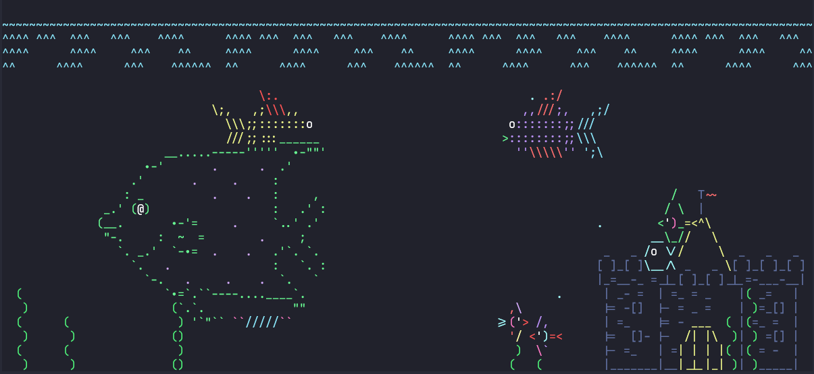

<h1><center>⛵🐍🦈🐳🐟🐠🐡🦢🦆🏰</center><h1>

## 🚀 Quick Installation ASCiiQuarium

[ASCiiQuarium](https://robobunny.com/projects/asciiquarium/html/?page=0) is an interesting Linux command

Enjoy the mysteries of the sea from the safety of your own terminal 🥰

> Most Ubuntu systems are currently supported, such as Ubuntu 18/20/22



Let this command be your screensaver !

⚙**Usage**

Clone this repo to local

```bash
$ git clone https://github.com/lmk123568/Quick-Installation-ASCIIQuarium.git
```

Go to the directory and run the script `install.sh`

```bash
$ cd Quick-Installation-ASCIIQuarium/
$ bash install.sh
```

📣**Update**

- (2022-8-1) Compatible with most Ubuntu systems
- Coming soon (Adaptation to CentOS) ......

🔗**Refer**

Thank them for their contribution 👍

- https://robobunny.com/projects/asciiquarium/html/?page=0

- https://metacpan.org/pod/Term::Animation
